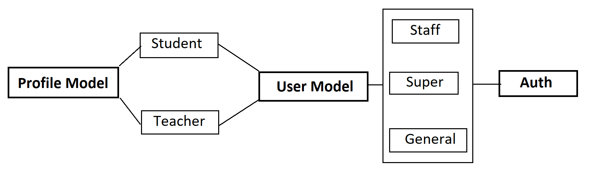

# :skull: backEnd (SWE Society Website)
### developing on django (2.0 or up)
***

## Dependency:
 * ### Django 2.15 or up
 * ### Python 3.6.0 or up
 * ### Database: `PostgreSQL` 10.0 or up
   * #### User: swe
   * #### Password: pass1234
   * #### Name: swedb
***
## Deployment:
 * Install the packages
   `pip3 install -r requirements.txt`
   
 * Migrattion the project with database
   * `python3 manage.py makemigrations`
 
   * `python3 manage.py migrate`
   
 * Create Admin User
   * `python3 manage.py createsuperuser`
   * >> UserId: 2016831035
   * >> Name: Rafiul Islam
   * >> Is Student: True
   * >> Password: #######
   * >> Confirm Password: #######
	
	
* Run the Server
  * `python3 manage.py runserver 0.0.0.0:8000`
***

## Workflow:

### urls:
  * #### example.com/ (template = index.html)
  * #### example.com/login (template = login.html) [not dialog view]```no registration page```
  * #### example.com/opensource (template = opensource.html) [view is not comfirmed yet, will be updated]
  * #### example.com/id (template = profile.html) [see profile structure](https://github.com/swesust/front-end)
  * #### example.com/batch (template = batchlist.html) [all batch list]
  * #### example.com/batch/2017 (template = batch.html)[every particular batch students]
  * #### example.com/faculty (template = faculty.html) [teachers list]
  
### templates:
#### `base.html` will carry the base header and a content block. Every extended or inherited .html file will set on the content block of the base view

#### `prototype of base.html`
```html
<!DOCTYPE html>
<html>
<head>

	<link rel="stylesheet" type="text/css" href="">
	<script type="text/javascript"></script>

	

	<!-- extended page header -->

	

</head>
<body>
 	
 	<div class="header"></div>

 	

 	<!-- extended page contents -->

 	

 	<div class="footer"></div>

</body>
</html>

```

#### `prototype of other templates`
```html




	
	<title></title>
	<link rel="stylesheet" type="text/css" href="">
	<script type="text/javascript"></script>






<div class="contents">
	
	<!-- page contents -->

</div>



```

***
### User profile and authentication:


#### `User types`


General | Staff | Super
--- | --- | --- 
Can only log in into site have no permission to visit admin panel | Can log in into site and have the permission to visit admin panel and also have some limited permission on admin panel functionality | Can log in into site and admin panel and have every permission. Super user will destroy after deploying. Available in developing version.
